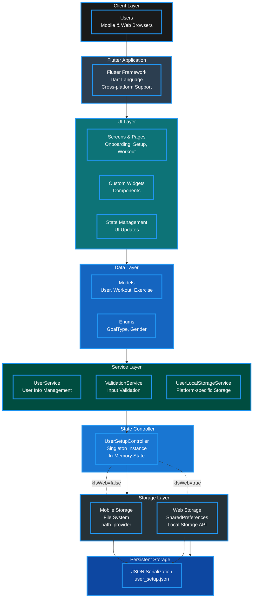

# FitGo – Fitness & Workout App (Flutter)

## Project Overview
**FitGo** is a mobile fitness application built using **Flutter**.  
The app helps users **lose weight** or **build muscle** by providing guided workouts, timers, and progress tracking.

This project is created as the **final project for the Frontend (Flutter) course**.

---

## Purpose of the App
- Help users choose workouts based on their body information  
- Support both **weight loss** and **muscle gain**  
- Provide simple **daily workout plans**  
- Track workout progress and completion  

---

## Main Features
- Onboarding screens with app introduction  
- Gender selection (Male / Female)  
- Height and weight input  
- User information form  
- BMI / weight average result  
- Daily workout plans (Day 1 – Day 7)  
- Exercise list with images  
- Workout timer (reps and time-based)  
- Progress tracking (completed percentage)  
- Clean and modern UI design  

---

## System Architecture

### Architecture Flow:

The application follows a clean layered architecture pattern:

1. **Client Layer** → Users interact through mobile and web interfaces
2. **Flutter Application** → Cross-platform framework (Android, iOS, Web)
3. **UI Layer** → Screens, widgets, and state management
4. **Data Layer** → Models and enums for data structure
5. **Service Layer** → Business logic (UserService, ValidationService, StorageService)
6. **UserSetupController** → Central singleton for in-memory state management
7. **Storage Layer** → Platform-specific persistent storage
   - **Mobile**: File System using `path_provider`
   - **Web**: SharedPreferences using Local Storage API
8. **Persistent Storage** → JSON serialization (`user_setup.json`)

### Data Flow:

**Save Flow:**
1. User Input → UI Layer → ValidationService → UserService
2. UserService → UserSetupController (in-memory)
3. When setup complete → UserLocalStorageService.saveUserSetup()
4. Platform detection (kIsWeb) → Mobile/Web Storage → JSON file

**Load Flow:**
1. App starts → UserLocalStorageService.loadUserSetup()
2. Read from platform-specific storage → Parse JSON
3. Load data into UserSetupController → Update UI

---

## Technologies Used
- **Flutter** - Cross-platform framework
- **Dart** - Programming language
- **Material Design** - UI/UX components
- **path_provider** - File system access (mobile)
- **shared_preferences** - Local storage (web)
- **Frontend only** (no backend)

---

## App Screens
- Welcome and onboarding pages  
- User setup (gender, height, weight)  
- Workout dashboard  
- Daily exercise list  
- Exercise detail screen with timer  

---

## What I Learned
- Flutter layout system (Column, Row, Stack)
- Navigation between screens
- Using widgets and custom UI components
- Handling user input with validation
- State management for UI updates
- Designing mobile-friendly interfaces
- Implementing clean architecture patterns
- Managing platform-specific storage (mobile vs web)
- Singleton pattern for state management
- JSON serialization and deserialization

---

## Future Improvements
- Add backend and user authentication  
- Save workout progress using a database  
- Add more workout types and exercises
- Implement workout history tracking
- Add dark mode support
- Improve animations and overall UX  
- Add social features (share progress)
- Integrate fitness APIs (step counter, heart rate)

---
