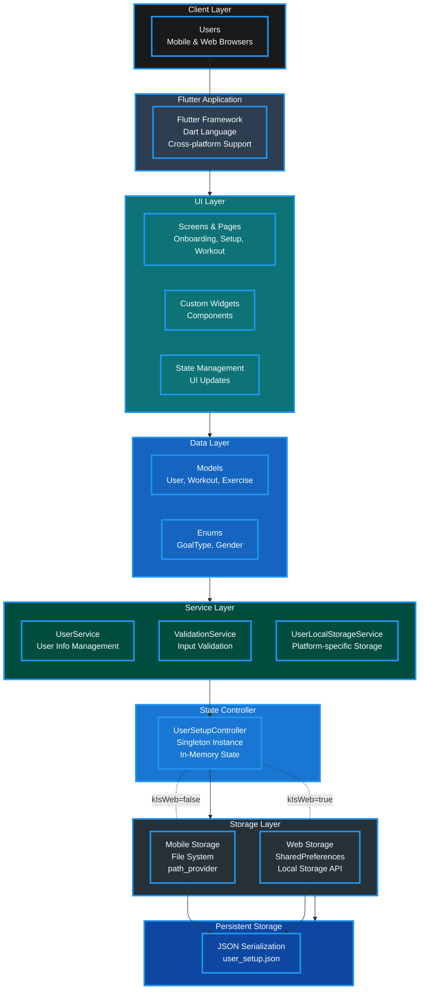

# FitGo – Fitness & Workout App (Flutter)

## Project Overview
**FitGo** is a mobile fitness application built using **Flutter**.  
The app helps users **lose weight** or **build muscle** by providing guided workouts, timers, and progress tracking.

This project is created as the **final project for the Frontend (Flutter) course**.

---

## Main Features
- Onboarding and user setup (gender, height, weight, BMI)
- Daily workout plans (30 days)
- Exercise library with images and instructions
- Workout timer (reps and time-based)
- Cross-platform (Android, iOS, Web)

### App Demo

<div align="center">
  
  
  
  
</div>

---

## System Architecture

```mermaid
graph TB
    subgraph CLIENT["Client Layer"]
        USER[Users<br/>Mobile & Web Browsers]
    end

    subgraph APP["Flutter Application"]
        FLUTTER[Flutter Framework<br/>Dart Language<br/>Cross-platform Support]
    end

    subgraph PRESENTATION["UI Layer"]
        direction LR
        SCREENS[Screens & Pages<br/>Onboarding, Setup, Workout]
        WIDGETS[Custom Widgets<br/>Components]
        STATE[State Management<br/>UI Updates]
    end

    subgraph DATA_LAYER["Data Layer"]
        direction LR
        MODELS[Models<br/>User, Workout, Exercise]
        ENUMS[Enums<br/>GoalType, Gender]
    end

    subgraph SERVICE_LAYER["Service Layer"]
        direction TB
        USER_SERVICE[UserService<br/>User Info Management]
        VALIDATION[ValidationService<br/>Input Validation]
        STORAGE_SERVICE[UserLocalStorageService<br/>Platform-specific Storage]
    end

    subgraph CONTROLLER["State Controller"]
        SETUP_CONTROLLER[UserSetupController<br/>Singleton Instance<br/>In-Memory State]
    end

    subgraph STORAGE["Storage Layer"]
        direction LR
        MOBILE[Mobile Storage<br/>File System<br/>path_provider]
        WEB[Web Storage<br/>SharedPreferences<br/>Local Storage API]
    end

    subgraph PERSISTENCE["Persistent Storage"]
        JSON[JSON Serialization<br/>user_setup.json]
    end

    USER --> FLUTTER
    FLUTTER --> PRESENTATION
    PRESENTATION --> DATA_LAYER
    DATA_LAYER --> SERVICE_LAYER
    SERVICE_LAYER --> SETUP_CONTROLLER
    SETUP_CONTROLLER --> STORAGE
    STORAGE --> PERSISTENCE
    
    SETUP_CONTROLLER -.kIsWeb=false.-> MOBILE
    SETUP_CONTROLLER -.kIsWeb=true.-> WEB
    
    MOBILE --> JSON
    WEB --> JSON

    classDef clientStyle fill:#1a1a1a,stroke:#2196F3,stroke-width:3px,color:#ffffff
    classDef appStyle fill:#2c3e50,stroke:#2196F3,stroke-width:3px,color:#ffffff
    classDef uiStyle fill:#0d7377,stroke:#2196F3,stroke-width:3px,color:#ffffff
    classDef dataStyle fill:#1565c0,stroke:#2196F3,stroke-width:3px,color:#ffffff
    classDef serviceStyle fill:#004d40,stroke:#2196F3,stroke-width:3px,color:#ffffff
    classDef controllerStyle fill:#1976d2,stroke:#2196F3,stroke-width:3px,color:#ffffff
    classDef storageStyle fill:#263238,stroke:#2196F3,stroke-width:3px,color:#ffffff
    classDef persistStyle fill:#0d47a1,stroke:#2196F3,stroke-width:3px,color:#ffffff
    
    class CLIENT,USER clientStyle
    class APP,FLUTTER appStyle
    class PRESENTATION,SCREENS,WIDGETS,STATE uiStyle
    class DATA_LAYER,MODELS,ENUMS dataStyle
    class SERVICE_LAYER,USER_SERVICE,VALIDATION,STORAGE_SERVICE serviceStyle
    class CONTROLLER,SETUP_CONTROLLER controllerStyle
    class STORAGE,MOBILE,WEB storageStyle
    class PERSISTENCE,JSON persistStyle
```

### Architecture Overview

**Layered Architecture:**
1. **UI Layer** - Screens, widgets, state management
2. **Data Layer** - Models and enums
3. **Service Layer** - Business logic (validation, storage)
4. **Controller** - UserSetupController (singleton)
5. **Storage Layer** - Platform-specific persistence (mobile/web)

**Data Flow:**
- **Save**: UI → Validation → UserService → UserSetupController → Storage → JSON
- **Load**: Storage → Parse JSON → UserSetupController → Update UI

---

## Technologies Used
- **Flutter** - Cross-platform framework
- **Dart** - Programming language
- **Material Design** - UI components
- **path_provider** - File system (mobile)
- **shared_preferences** - Local storage (web)

---

## Installation
```bash
# Clone repository
git clone https://github.com/piseyKhenchandara/FitGo-flutter-final-project.git

# Navigate to project
cd fit_go

# Install dependencies
flutter pub get

# Run on web
flutter run -d chrome --web-port 8080

# Run on mobile
flutter run
```


## Contact

**Developer:** Pisey Khenchandara,Soy Chanratana
**GitHub:** [@piseyKhenchandara](https://github.com/piseyKhenchandara)
**GitHub:** [@SoyChanratana](hhttps://github.com/Zorina69)

---

## License

Educational project for Flutter course final project.

---

## Future Improvements
- Add backend and user authentication  
- Save workout progress using a database  
- Add more workout types and exercises
- Implement workout history tracking
- Add dark mode support
- Improve animations and overall UX  
- Add social features (share progress)
- Integrate fitness APIs (step counter, heart rate)

---

## UML Class Diagram

For a detailed class-level view of models, services, and controller relationships, see [docs/uml.md](docs/uml.md).

